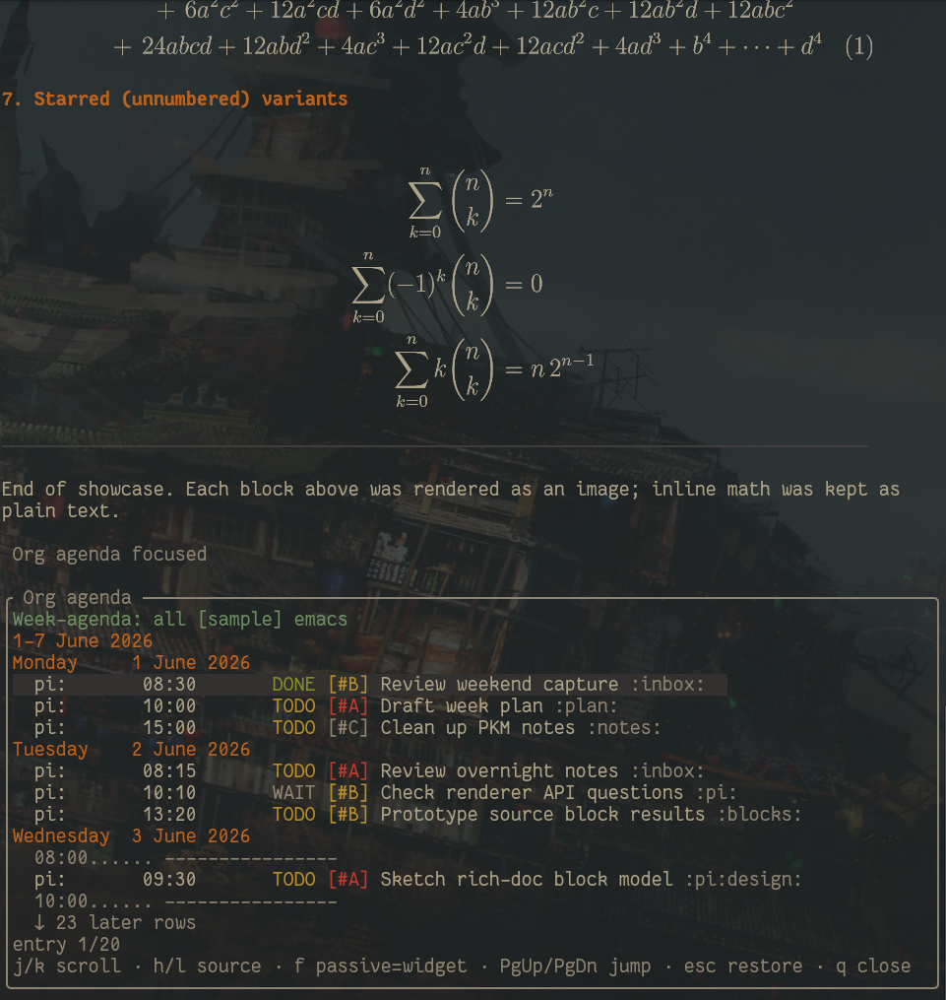

<p align="center">
  
</p>

# pi-tools

A small package of [pi](https://github.com/earendil-works/pi-coding-agent) extensions and skills, mostly aimed at making pi feel more at home on a NixOS box and pushing toward a richer, org-mode-flavored document experience inside the TUI.

The project is intentionally experimental — see [`docs/GOAL.md`](docs/GOAL.md) for the broader direction.

<p align="center">
  
  <br />
  <em>Tail of <code>/latex-renderer-test</code> with the <code>/org-agenda</code> pane focused below.</em>
</p>

## Extensions

| Extension | What it does | Docs |
| --- | --- | --- |
| `dev-shell-manager` | Creates reusable Nix flake dev shells on demand under `~/dev/pi-agent-shells/<name>`. | [docs/dev-shell-manager.md](docs/dev-shell-manager.md) |
| `nix-env-feedback` | Watches bash failures for missing commands and steers the model toward an existing reusable shell. Adds `/cmdstats`. | [docs/nix-env-feedback.md](docs/nix-env-feedback.md) |
| `latex-renderer` | `render_latex` tool that displays Markdown with block LaTeX rendered as inline PNGs. Adds `/latex-renderer-test`. | [docs/latex-renderer.md](docs/latex-renderer.md) |
| `pi-pkm` | Org-style agenda pane in the TUI with pluggable providers (sample + emacs). Adds `/org-agenda` and `Alt+X`. | [docs/pi-pkm.md](docs/pi-pkm.md) |

## Skills

- `skills/nixos-dev-shells/` — selection rules for host vs. project flake vs. reusable shell. Paired with the two nix extensions above.

## Install

Clone the repo, then install it globally as a pi package:

```bash
pi install <path-to-clone>
```

Or add the clone path to the `packages` array in `~/.pi/agent/settings.json` (global) or `.pi/settings.json` (per-project). If you manage pi via Nix, list the clone path under the same `packages` entry in your config.

## Develop

```bash
npm install
npm run fix     # biome format + lint --write
npm run check   # biome check
```

Smoke tests (run each extension in isolation, no session, no tools, no network):

```bash
pi --no-session --no-tools --offline -e ./extensions/pi-pkm.ts -p /org-agenda
pi --no-session --no-tools --offline -e ./extensions/latex-renderer.ts -p /latex-renderer-test
```

## License

GPL-3.0 — see [LICENSE](LICENSE).
