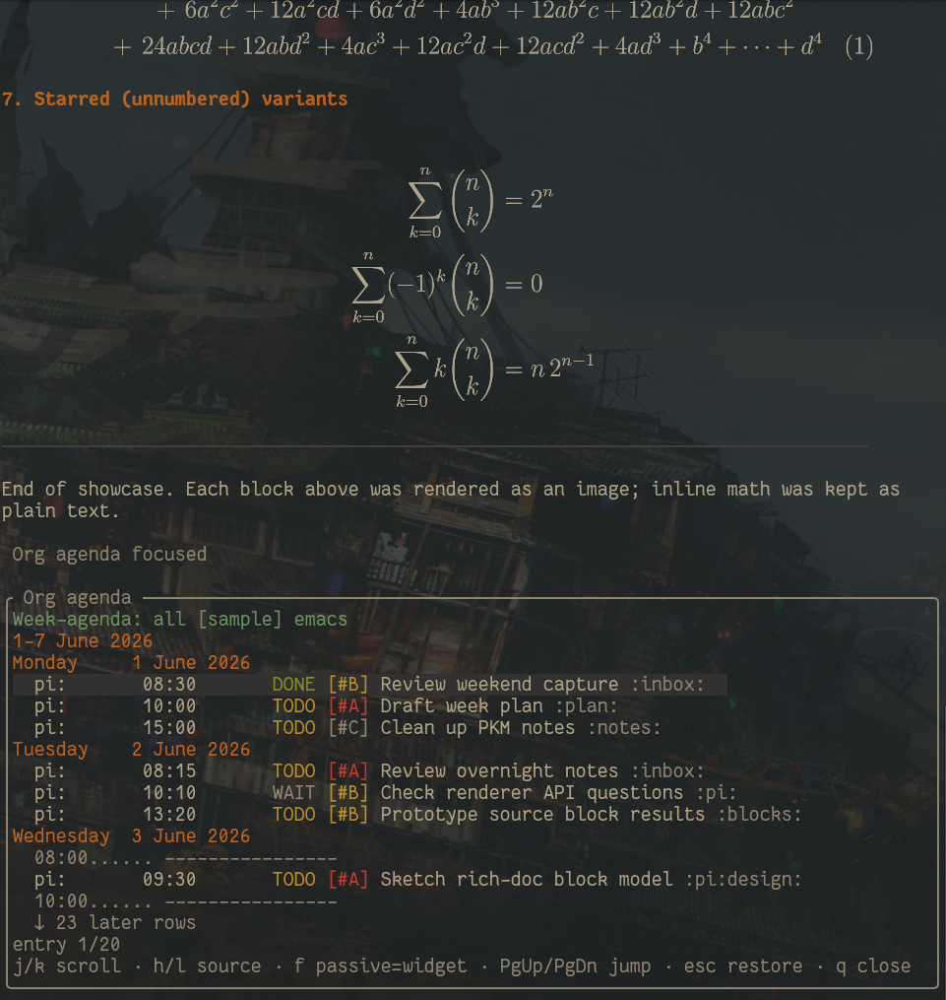

<p align="center">
  
</p>

# pi-tools

[Pi](https://github.com/earendil-works/pi-coding-agent) extensions, skills, and a browser CLI.

<p align="center">
  
</p>

## What is included

| Name                  | Purpose                                                                | Details                                              |
| --------------------- | ---------------------------------------------------------------------- | ---------------------------------------------------- |
| `audio-transcription` | Registers `transcribe_audio` when Whisper is available.                | [Audio transcription](docs/audio-transcription.md)   |
| `dev-shell-manager`   | Creates reusable Nix dev shells.                                       | [Dev shell manager](docs/dev-shell-manager.md)       |
| `nix-env-feedback`    | Detects missing commands in bash output. Adds `/cmdstats`.             | [Nix environment feedback](docs/nix-env-feedback.md) |
| `latex-renderer`      | Renders block LaTeX as images in pi.                                   | [LaTeX renderer](docs/latex-renderer.md)             |
| `pi-pkm`              | Displays tasks from the builtin, todo.txt, and Emacs agenda providers. | [Pi PKM](docs/pi-pkm.md)                             |
| `bot`                 | Attaches the current Pi conversation to the bot daemon.                              | [Bot integration](docs/bot.md)                       |
| `agent-bridge`        | Maps project topics and conversation threads to Pi sessions. | [Agent bridge](docs/agent-bridge/telegram.md) |
| `browser-cli`         | Measures pages and interacts with Chrome through a local CLI.          | [Browser CLI](docs/browser-cli.md)                   |

The `nixos-dev-shells`, `btca-local`, `linear-cli`, and [`browser-cli`](skills/browser-cli/SKILL.md) skills live in `skills/`.

## Install

Install this repository as a pi package:

```sh
pi install <path-to-clone>
```

Pi discovers the extensions and skills. For a source checkout, install dependencies and run the CLI:

```sh
npm ci
node bin/browser-cli.mjs help
```

Pi installs the root Playwright dependency when it installs pi-tools from git. The [browser-cli skill](skills/browser-cli/SKILL.md) covers Chrome, FFmpeg for MP4 recording, and CLI setup. Run `npm link` to put the source-checkout CLI on `PATH`.

### Home Manager

The flake exports an optional Home Manager module:

```nix
imports = [ inputs.pi-tools.homeManagerModules.default ];

programs.pi-tools = {
  enable = true;
  piCliPackage = inputs.llm-agents.packages.${pkgs.stdenv.hostPlatform.system}.pi;
  bot.enable = true;
  audioTranscription.enable = true;
};
```

With `programs.pi-tools.enable = true`, the module adds the Nix-built `browser-cli` executable to `PATH` through `home.packages`.

Set `programs.pi-tools.browserCli.enable = false;` to omit the CLI, its skill, and Playwright. This selects `packages.<system>.without-browser-cli`. Set `programs.pi-tools.browserCli.package` to use a different CLI build. The default is `packages.<system>.browser-cli`. The old `browserCheck` option still works and warns to use `browserCli`.

The module also writes pi settings and installs `piCliPackage` if supplied. The `bot` and `audioTranscription` options are off unless enabled.

`programs.pi-tools.agentBridge.enable` installs the bridge CLI; it does not start a daemon. On Linux, additionally set `programs.pi-tools.agentBridge.service.enable = true;` for the opt-in systemd user service. Keep credentials in the private environment file, not Nix expressions. Stop any foreground poller before activating the service. See [service setup and migration](docs/agent-bridge/telegram.md#home-manager-user-service-linux).

The CLI now defaults to `$XDG_DATA_HOME/browser-cli` or `~/.local/share/browser-cli`. It does not migrate existing data. See [rename and data compatibility](docs/browser-cli.md#rename-and-data-compatibility) before reusing old profiles. Activate the updated Home Manager generation to put the renamed executable on `PATH`. For a source checkout, rerun `npm link`. Reload Pi to discover the renamed skill.

The default pi theme is `gruvbox-dark`. The module also includes `pi-web-access` and the [CLIProxyAPI provider fork](https://github.com/andyp1xe1/pi-cliproxyapi-provider). Set `theme = null;` or `recommendedPackages = [];` to omit these defaults. Use `extraPackages` and `settings` for other pi settings.

See the [CLIProxyAPI setup docs](https://help.router-for.me/agent-client/pi.html).

The module also installs Herdr with Gruvbox, upstream agent integrations, and a Herdr skill. Global Pi instructions keep delegated work in visible panes with saved sessions. Set `programs.pi-tools.herdr.enable = false;` to disable this setup.

## Develop

```sh
npm install
npm run check
npm run fix
npm run test:browser-cli
npm run test:agent-bridge
npm run test:bot
npm run test:extensions
```

The project's `nix develop` shell supplies flake-selected Node 22, Bun and FFmpeg for reproducible development commands. If those tools already work on your host, ordinary npm checks can run directly; npm scripts use the project's local TypeScript/Biome executables. The shell does not install `node_modules`, activate Home Manager or start the bridge. Installed packages and the user service do not depend on a development shell.

Every extension is a thin entrypoint calling a named registration function. The standalone daemon and Telegram infrastructure live in `src/agent-bridge/`; Pi integration lives in `src/bot/`, reached through `extensions/bot.ts`. Their boundary is a portable, validated IPC client/protocol, not shared Pi or Telegram execution code. See [Code boundaries and bridge lifecycle](docs/architecture.md).

Run either extension without a session or network access:

```sh
pi --no-session --no-tools --offline -e ./extensions/pi-pkm.ts -p /org-agenda
pi --no-session --no-tools --offline -e ./extensions/latex-renderer.ts -p /latex-renderer-test
```

## Attribution and license

- [Telegram bridge attribution](src/agent-bridge/telegram/NOTICE.md)
- [`btca-local` source](https://github.com/davis7dotsh/better-context/blob/main/skills/btca-local/SKILL.md)
- [GPL-3.0 license](LICENSE)
